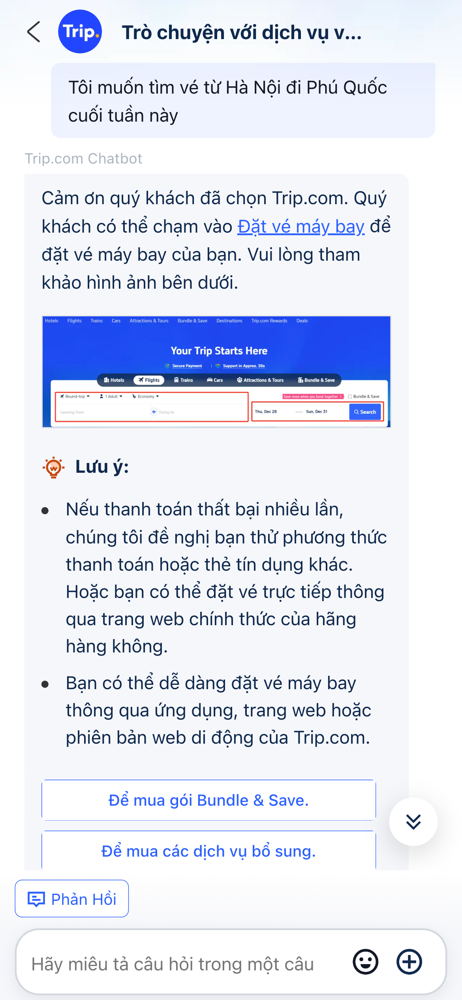
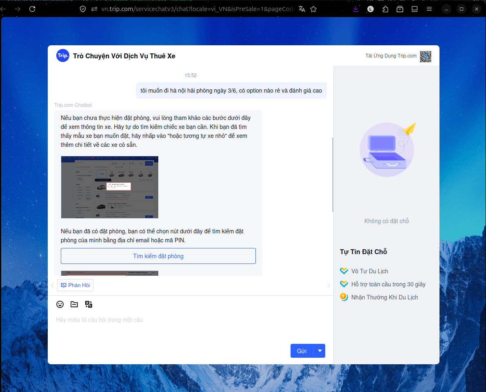
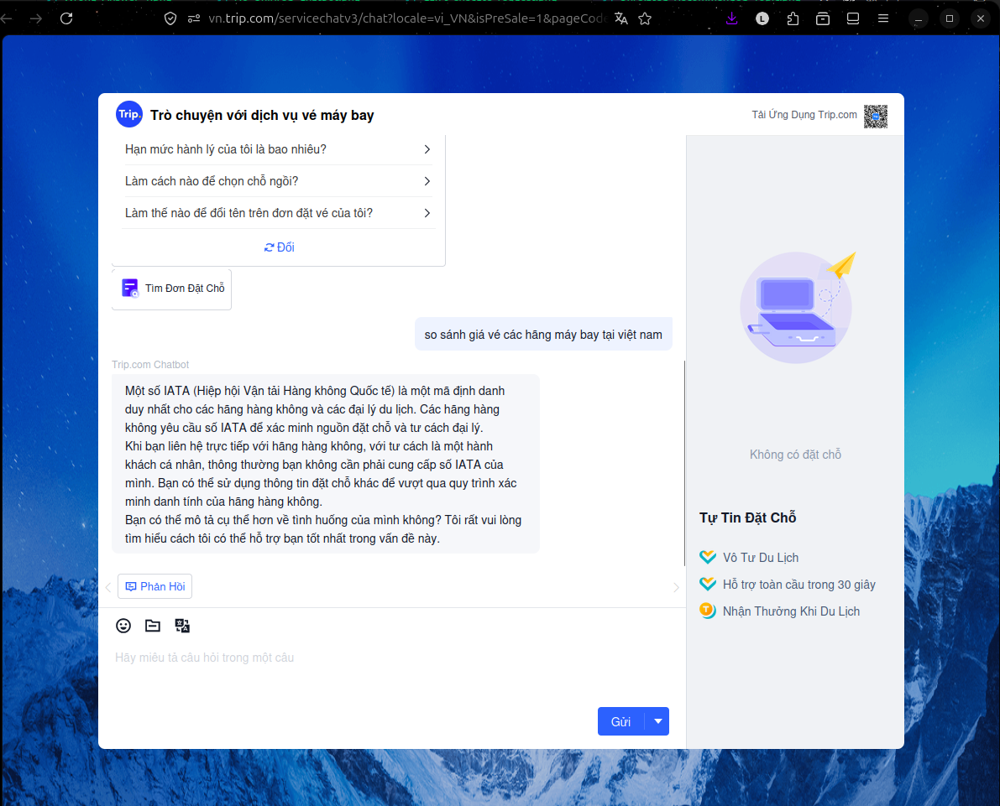
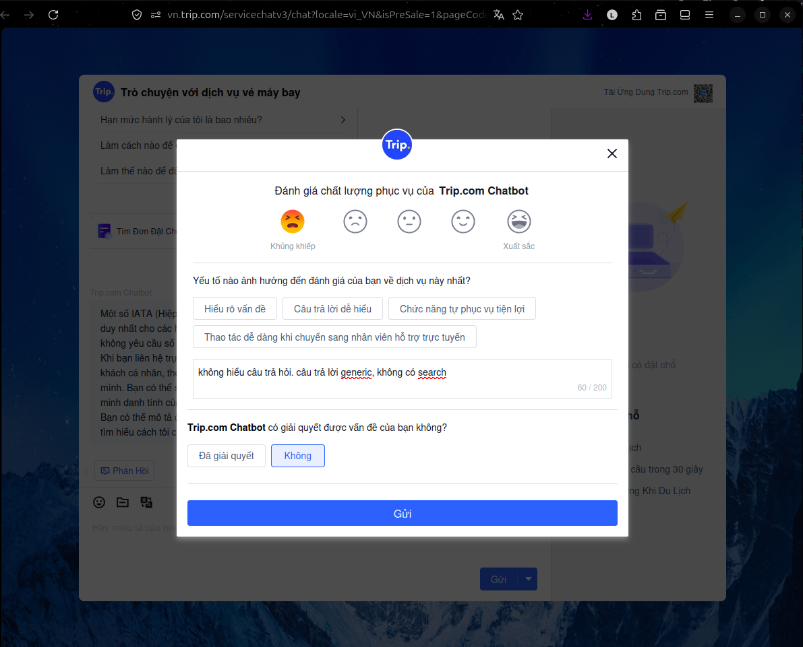
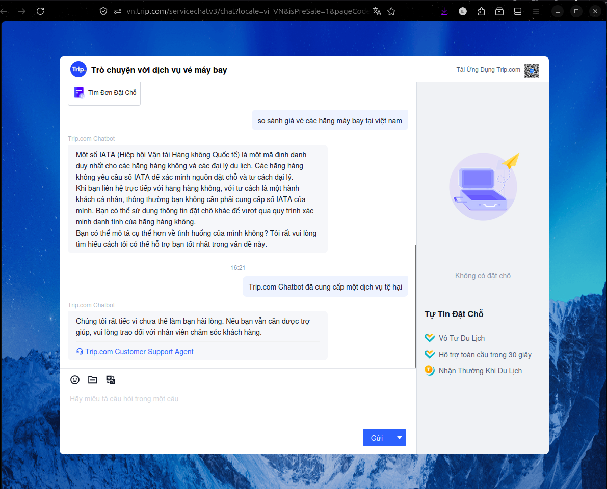
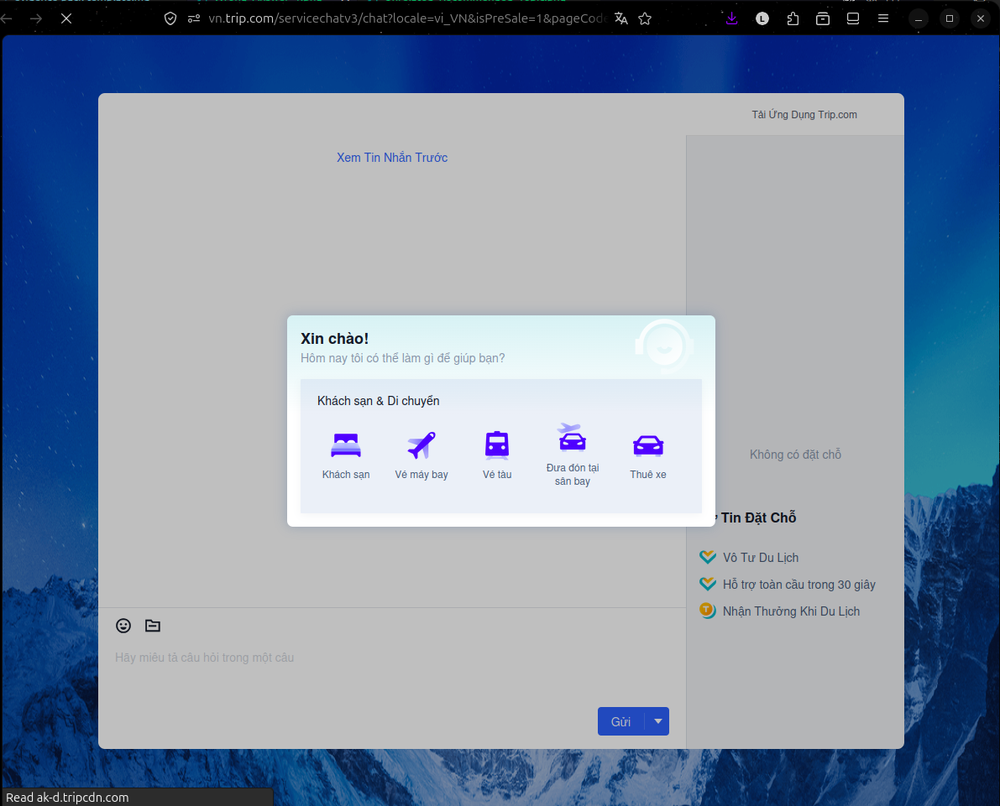
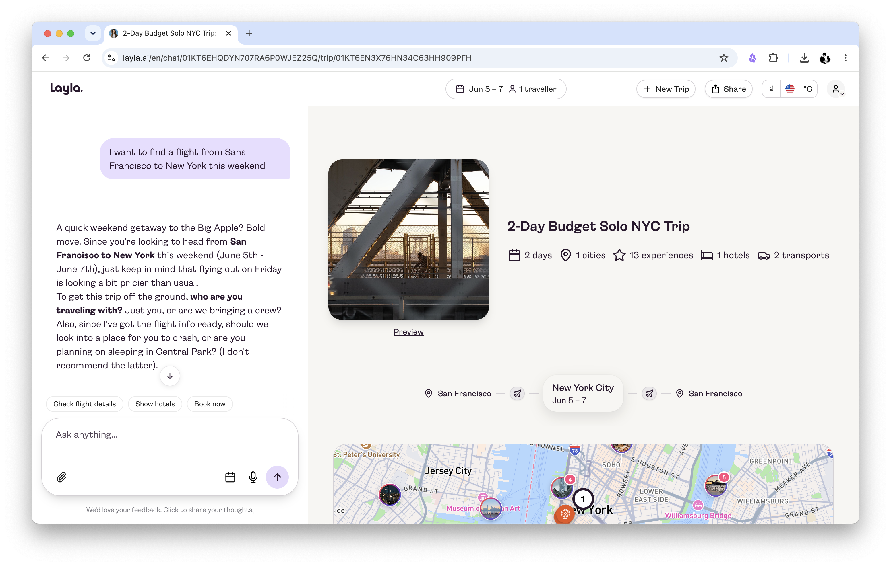
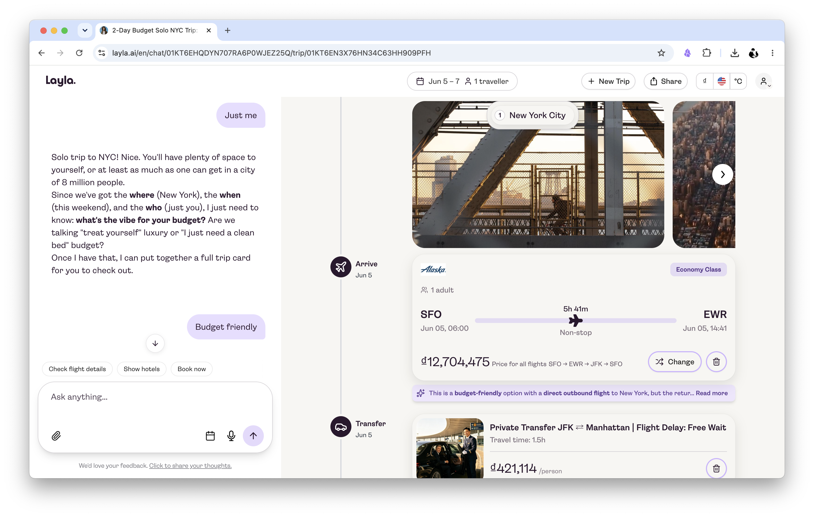

## 1. Nhóm và track

**Tên nhóm:**  Chill Guys
**Track:**  Travel and Hospitality
**Product/app đã chọn:**  Trip.com
**Build slice đang nghĩ:**  Khách du lịch muốn tìm kiếm phương tiện di chuyển -> AI hỏi 3 câu -> Gợi ý nhiều phương án hợp lý -> Failure: flag lại, chuyển hướng người dùng tự kiếm

## 2. Self-use evidence

Nhóm tự dùng Trip.com chatbot với nhu cầu chính: khách du lịch muốn tìm kiếm phương tiện di chuyển. Nhóm thử nhiều câu hỏi tự nhiên bằng tiếng Việt, bao gồm tìm vé máy bay, vé tàu, thuê xe, so sánh lựa chọn di chuyển và yêu cầu chatbot đưa ra gợi ý cụ thể.

| Observation | Screenshot/link | Path liên quan | Điều học được |
|---|---|---|---|
| Khi người dùng hỏi một nhu cầu rất phổ biến như “Tôi muốn tìm vé từ Hà Nội đi Phú Quốc cuối tuần này”, chatbot không hỏi thêm thông tin cần thiết như ngày đi, ngày về, số người, ngân sách, ưu tiên giờ bay. Thay vào đó, chatbot chỉ hướng người dùng sang trang “Đặt vé máy bay” và đưa hướng dẫn chung. | <a href="Image/Uncertain_Path.png"></a> | `Low-confidence` | Chatbot chưa thực sự đóng vai trò travel assistant. Nó không hiểu intent đủ sâu để chủ động thu thập thông tin và tạo hành trình tìm kiếm. Với use case tìm phương tiện di chuyển, đây là điểm gãy lớn vì người dùng vẫn phải tự thao tác gần như toàn bộ. |
| Với câu “Tìm cho tôi chuyến đi từ Sài Gòn ra Đà Nẵng ngày 10 tháng 6”, chatbot vẫn trả lời bằng template hướng dẫn đặt vé máy bay, không parse được điểm đi, điểm đến, ngày đi để tạo search query. | <a href="Image/Uncertain_Path_2.png"></a> | `Low-confidence` | Ngay cả khi người dùng đã cung cấp origin, destination và date, chatbot không chuyển thành action cụ thể. Điều này cho thấy hệ thống chưa có intent extraction + slot filling đủ tốt. |
| Khi người dùng hỏi “so sánh giá vé các hãng máy bay tại Việt Nam”, chatbot trả lời lạc đề về mã IATA và quy trình xác minh hãng hàng không. Đây không phải câu trả lời cho nhu cầu so sánh giá. | <a href="Image/Wrong_Answer_1.png"></a><br><a href="Image/Wrong_Answer_2.png"></a> | `Failure` | Chatbot có dấu hiệu hiểu sai keyword “hãng máy bay” thành thông tin về ngành hàng không / IATA. Nó không nhận ra người dùng đang hỏi về comparison shopping. Với travel planning, failure này nguy hiểm vì người dùng cần thông tin quyết định nhanh nhưng nhận được nội dung không liên quan. |
| Sau khi người dùng đánh giá chatbot tệ và ghi feedback “không hiểu câu trả hỏi, câu trả lời generic, không có search”, hệ thống chỉ chuyển sang human support chứ không có cơ chế tự sửa câu trả lời hoặc hỏi lại. | <a href="Image/Correction_1.png"></a><br><a href="Image/Correction_2.png"></a><br><a href="Image/Correction_3.png"></a> | `Correction` | Correction path hiện tại là `report / handoff` chứ chưa phải conversational correction. Chatbot không tận dụng feedback để thử lại, làm rõ intent, hoặc đề xuất query mới. |
| Trong flow vé tàu, khi người dùng hỏi “vậy bạn làm được điều gì”, chatbot không trả lời được năng lực của chính nó, chỉ báo không hiểu câu hỏi và gợi ý một câu hỏi khác. | <a href="Image/Can't_Understand_Question.png"></a> | `Failure` | Chatbot thiếu self-awareness về scope. Người dùng không biết nên hỏi gì, chatbot cũng không giải thích được nó có thể hỗ trợ gì. Đây là friction lớn ở bước onboarding hoặc khi người dùng gặp lỗi. |
| Với yêu cầu đặt vé tàu cụ thể “đặt cho tôi vé tàu ngày 3/6 đi Hà Nội từ Hải Phòng”, chatbot chỉ đưa link “Tìm kiếm tàu hoả” và hướng dẫn chung, không thực hiện tìm kiếm hoặc xác nhận thông tin. | <a href="Image/Can't_execute_request.png"></a> | `Failure` | Chatbot chưa execute được request, chỉ redirect. Với build slice của nhóm, đây là bằng chứng rõ rằng cần một agent có khả năng hỏi thêm thông tin, gọi search tool/API, rồi trả lại options. |
| Chatbot bị tách theo từng dịch vụ như vé máy bay, vé tàu, thuê xe. Người dùng phải chọn service trước, thay vì nói một nhu cầu tổng quát như “đi Hà Nội - Hải Phòng ngày 3/6 có option nào rẻ và đánh giá cao”. | <a href="Image/No_Unififed_Chatbot.png"></a> | `Failure` | Trip.com hiện chưa có unified mobility assistant. Với nhu cầu “tìm phương tiện di chuyển”, người dùng thường không chắc nên đi máy bay, tàu, xe hay thuê xe. Chatbot tách silo làm mất cơ hội so sánh đa phương án. |
| Trong flow thuê xe, khi người dùng hỏi “tôi muốn đi Hà Nội Hải Phòng ngày 3/6, có option nào rẻ và đánh giá cao”, chatbot chỉ đưa hướng dẫn đặt xe kèm ảnh minh hoạ, không trả về option cụ thể, giá, rating hay câu hỏi làm rõ. | <a href="Image/No_Unififed_Chatbot.png"></a> | `Low-confidence / Failure` | Chatbot nhận ra domain thuê xe nhưng không đáp ứng bài toán lựa chọn. Với người dùng, câu trả lời này không giúp ra quyết định. Cần thiết kế lại response thành dạng ranked options hoặc fallback có ích hơn. |

### Key insight rút ra từ self-use

Qua các thử nghiệm, Trip.com chatbot hiện tại hoạt động giống FAQ + redirect bot hơn là AI travel assistant. Nó có thể hướng người dùng đến đúng khu vực trong app/web, nhưng thường không:

- hiểu đầy đủ intent di chuyển
- hỏi thêm thông tin còn thiếu
- so sánh nhiều phương án
- gọi search để trả kết quả thật
- sửa câu trả lời khi người dùng phản hồi sai
- hoạt động thống nhất giữa `flight / train / car`

Điểm gãy quan trọng nhất cho build slice của nhóm là: người dùng muốn nói nhu cầu di chuyển bằng ngôn ngữ tự nhiên, nhưng chatbot hiện tại bắt người dùng tự chuyển nhu cầu đó thành thao tác tìm kiếm thủ công.

## 3. User / review / social evidence

Nguồn có thể là review App Store/Play, group, comment, phỏng vấn nhanh, hoặc nguồn public khác.

| Quote / review / observation | Nguồn | User là ai? | Pain/failure mode |
|---|---|---|---|
| "Mình muốn đi từ Sài Gòn ra Đà Nẵng nhưng không biết nên đi máy bay hay xe. Để check giá vé máy bay, mình phải mở 1 tab. Rồi lại phải out ra 1 tab khác để check vé tàu." | Phỏng vấn dự kiến - cần kiểm chứng với người từng đi liên tỉnh | Người đi du lịch hoặc về quê, tự đặt vé | Decision overload: user thiếu một nơi gom lựa chọn và giải thích nên chọn phương tiện nào theo bối cảnh. |
| "Chatbot chỉ gửi mình sang trang đặt vé, không hỏi thêm ngày đi, ngân sách hay mình ưu tiên rẻ hay nhanh. Vậy thì mình vẫn phải tự làm gần hết." | Review/phỏng vấn dự kiến - cần kiểm chứng bằng review app hoặc phỏng vấn nhanh | User muốn hỏi bằng ngôn ngữ tự nhiên thay vì tự bấm form | Low-confidence path yếu: chatbot không chủ động hỏi lại thông tin thiếu và không chuyển câu hỏi thành search query cụ thể. |
| "Giá ban đầu nhìn rẻ, nhưng lúc chọn hành lý, điểm đón hoặc đến bước thanh toán thì tổng tiền khác. Nếu bot tư vấn mà không nói rõ nguồn giá và thời điểm kiểm tra thì mình không dám tin." | Review/phỏng vấn dự kiến - cần kiểm chứng với người từng đặt vé máy bay/xe khách | Người nhạy cảm về giá, cần quyết định nhanh nhưng sợ phí ẩn | Trust failure: cần hiển thị tổng giá, phí phụ, `last_checked_at`, chính sách hành lý/hoàn hủy và link xác nhận trên website chính thức. |

## 4. Competitor / analog evidence

| App / mô hình tham khảo | Họ xử lý task này thế nào? | Pattern học được | Có áp dụng trong 1 ngày không? |
|---|---|---|---|
| **Layla.ai** | Khi người dùng chat "Tôi muốn tìm chuyến đi...", bot tự nhận diện điểm đi/đến, nếu thiếu thông tin (như ngày đi, số người đi,khả năng tài chính), bot sẽ hỏi lại từng bước (slot-filling) và hiển thị danh sách các câu trả lời ngắn gọn, dễ hiểu ngay trong chat. <a href="Screenshots/layla-1.png"></a> <a href="Screenshots/layla-2.png"></a>| **Slot-filling hội thoại:** Hỏi lần lượt các trường thông tin còn thiếu.<br>**Interactive Widget:** Trả kết quả tìm kiếm ngay trong giao diện chat dưới dạng trực quan, dễ đọc. | **Có:** Chúng ta chỉ giả lập (mock/prototype) API trích xuất thực thể bằng LLM và thiết kế UI dạng widget ngay tại chatbot mockup để demo. |
| Rome2Rio | Bắt đầu từ nhu cầu đi từ A đến B, rồi so sánh nhiều phương thức như máy bay, xe, tàu, ô tô. | Multi-modal route planning: không ép user chọn dịch vụ trước; hệ thống tự đề xuất mode phù hợp. | Có. Mock 3 phương án: xe khách, máy bay, mixed route. |
| Skyscanner / Google Flights | Hiển thị nhiều lựa chọn bay, cho sort/filter theo giá, giờ bay, duration, hãng và redirect sang nơi đặt vé. | Comparison table, provider cards, `booking_url`, timestamp giá, lựa chọn tốt nhất theo tiêu chí. | Có. Áp dụng cho bảng so sánh flight/bus bằng mock data và link-out. |
| VeXeRe | Tập trung vào xe khách Việt Nam: nhà xe, giá, giờ đi, điểm đón/trả, loại xe, rating. | Bus-specific fields: provider, pickup/dropoff, duration, rating, refund policy rất quan trọng khi so với máy bay. | Có. Mock schema xe khách sát thị trường Việt Nam. |

---

## 5. Evidence -> Insight

```text
Evidence nổi bật nhất:
User cung cấp đầy đủ thông tin tìm chuyến bay (Hà Nội, Phú Quốc, cuối tuần này hoặc Sài Gòn, Đà Nẵng, 10/6) nhưng chatbot hoàn toàn phớt lờ các biến số này và chỉ trả về hướng dẫn chung để user tự đi tìm.

Insight:
User khi vào chat không chỉ muốn được "chỉ đường" hay đọc tài liệu hướng dẫn. 
Thật ra họ cần "giảm tải thao tác nhập liệu" (cognitive & physical load), muốn hệ thống tự động điền các thông tin họ đã nói và hiển thị kết quả ngay lập tức để họ chọn.

Opportunity:
AI có thể giúp bằng cách tự động nhận diện intent tìm kiếm chuyến đi, trích xuất điểm đi/điểm đến/ngày đi từ câu nói tự nhiên của user và điền vào form tìm kiếm (widget) trong chat.
```

---

## 6. Evidence đổi SPEC như thế nào?

* [ ] Đổi user chính.
* [x] Đổi pain statement.
* [x] Đổi build slice.
* [x] Đổi Auto/Aug decision.
* [x] Đổi 4 paths.
* [x] Đổi failure mode.
* [ ] Đổi owner/test plan.

**Thay đổi quan trọng:**
```text
Trước evidence, nhóm định: Làm một chatbot tổng quát trả lời mọi thông tin về du lịch.
Sau evidence, nhóm đổi thành: Chỉ tập trung duy nhất vào build slice "Hỗ trợ tìm kiếm chuyến đi trực tiếp" thông qua trích xuất thực thể hội thoại (Slot-filling) và hiển thị kết quả bằng Widget UI trong chat (chứ không trả về text hay link FAQ).
Lý do: Bằng chứng thực tế cho thấy điểm gãy lớn nhất của chatbot hiện tại là không xử lý được các thông số đầu vào cụ thể của user, biến trải nghiệm hội thoại trở nên vô dụng.
```