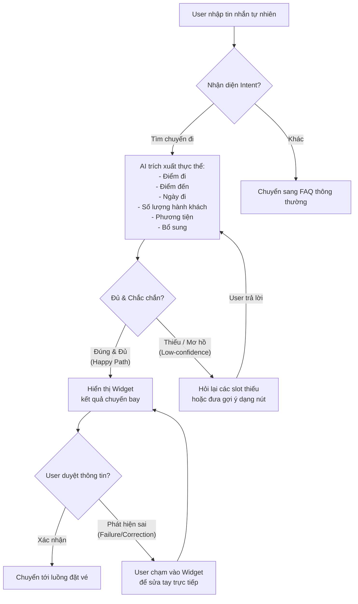

# Thin SPEC — Cải Thiện Chatbot Trip.com

Đây là bản cam kết kỹ thuật cho prototype sẽ xây dựng trong Day 06.

## 1. Track, product/app và user

* **Track:** Travel
* **Product/app thật:** Trip.com
* **User cụ thể:** Khách du lịch muốn tìm kiếm nhanh các cách di chuyển tới địa điểm du lịch.
* **Nhóm có phải user thật không?** Có, các thành viên nhóm thường xuyên đặt vé máy bay và gặp pain point tương tự khi dùng chatbot hỗ trợ.

---

## 2. Evidence summary

| Evidence | Nguồn | User/pain nói lên điều gì? | SPEC phải đổi gì? |
|---|---|---|---|
| Chatbot trả về FAQ chung chung khi user nói *"Tôi muốn tìm vé từ Hà Nội đi Phú Quốc cuối tuần này"* | Trải nghiệm thực tế | Bot không xử lý các tham số đầu vào cụ thể (địa điểm, thời gian) mà chỉ nhận diện keyword thô để trả link FAQ. | Bắt buộc phải tích hợp **Slot-filling** (trích xuất thông tin) và trả về kết quả động dạng **Widget UI** thay vì text tĩnh. |
| Chatbot trả lời y hệt khi đổi sang route khác *"Sài Gòn ra Đà Nẵng ngày 10 tháng 6"* | Trải nghiệm thực tế | Hệ thống chatbot hoàn toàn là FAQ-based, không có khả năng thực thi tác vụ (Task-oriented). | SPEC phải thiết kế luồng chuyển tiếp (Intent classification) để chuyển sang luồng Task-Oriented khi user muốn tìm kiếm. |

---

## 3. Pain statement

```text
User là khách du lịch đang gặp khó ở bước tìm chuyến đi nhanh bằng chatbot Trip.com,
vì hệ thống chỉ trả về hướng dẫn tĩnh bắt người dùng tự click link và nhập lại thông tin từ đầu,
dẫn tới trải nghiệm trò chuyện bị gãy, gây tốn thời gian và làm giảm tỷ lệ chuyển đổi đặt vé.
Bằng chứng chính là log chat:
- Gõ "Hà Nội đi Phú Quốc cuối tuần này" -> Bot bảo "chạm vào Đặt vé máy bay để tự đặt".
- Gõ "Sài Gòn ra Đà Nẵng ngày 10/6" -> Bot lặp lại hướng dẫn cũ.
```

---

## 4. Build slice

```text
Cho khách du lịch muốn tìm kiếm nhanh các cách di chuyển tới địa điểm du lịch,prototype sẽ dùng AI để tự động nhận diện intent và trích xuất thông số: Điểm đi, Điểm đến, Ngày đi, Phương tiện, tạo ra một mini-widget hiển thị danh sách vé phù hợp trực tiếp trong khung chat,và xử lý lỗi trích xuất sai bằng cách cho phép user click sửa nhanh các trường thông tin ngay trên widget (Human-in-the-loop).
```

---

## 5. Auto/Aug decision

* [ ] **Augmentation:** AI gợi ý/draft/phân loại, user quyết cuối.
* [x] **Conditional automation:** AI tự động trích xuất thông tin và tìm kiếm chuyến đi trong trường hợp nhận diện đủ thông tin; nếu thiếu hoặc mơ hồ, AI sẽ dừng lại hỏi (Low-confidence path) hoặc chuyển sang form chỉnh sửa thủ công để user duyệt.
* [ ] **Automation:** AI tự quyết và tự hành động.

* **Lý do chọn:** Việc đặt vé/tìm vé liên quan đến thông số chính xác (sai một chữ hoặc một ngày sẽ dẫn đến thiệt hại tài chính). Do đó, AI tự động điền (automation) nhưng cần user xác nhận cuối cùng (Human-in-the-loop) để đảm bảo độ tin cậy tuyệt đối.
* **Human role:** `decider` (Xác nhận thông tin trên widget trước khi tìm kiếm) và `rescuer` (Sửa thông tin khi AI nhận diện nhầm).

---

## 6. Four paths

### Luồng Hoạt Động (Flowchart)



### Chi tiết các Path trong Prototype:

| Path | Prototype phải thể hiện gì? |
|---|---|
| **Happy** | User gõ: *"Tìm vé từ Sài Gòn đi Đà Nẵng ngày 10/6"*.<br>AI nhận diện đủ 3 thực thể -> Hiển thị mini-widget chứa danh sách chuyến bay Sài Gòn - Đà Nẵng ngày 10/6 ngay trong chat. |
| **Low-confidence** | User gõ thiếu: *"Tìm vé đi Đà Nẵng ngày 10/6"*.<br>AI nhận diện thiếu điểm đi -> Bot hỏi lại kèm nút gợi ý nhanh: *"Bạn muốn đi từ đâu? [Hà Nội] [TP. HCM] [Đà Nẵng]"*. |
| **Failure** | User gõ: *"Vé đi Đà Nẵng từ Hà Nội"* nhưng AI nhận diện nhầm Đà Nẵng là điểm đi, Hà Nội là điểm đến -> Widget hiển thị tìm chuyến bay ngược: *"Đà Nẵng ➔ Hà Nội"*. |
| **Correction** | User nhìn thấy widget bị sai ở Failure Path -> Click trực tiếp vào icon hoán đổi chiều đi/đến trên Widget, hoặc chat: *"Không, tôi đi từ Hà Nội"* -> Widget tự cập nhật lại đúng chiều. |

---

## 7. Failure mode nguy hiểm nhất

```text
Nếu user nhập thông tin ngày mơ hồ (ví dụ: "thứ 6 tuần tới"),
AI có thể tính toán sai ngày khởi hành thật (ví dụ parse sai tuần này hoặc tuần sau nữa),
hậu quả là user đặt nhầm vé sai ngày, mất tiền hoàn hủy và lỡ kế hoạch.

Prototype sẽ xử lý bằng cách:
1. Luôn hiển thị thông tin ngày dạng chữ rõ ràng trên Widget xác nhận (ví dụ: "Thứ 6, 12/06/2026").
2. Nổi bật nút "Chỉnh sửa ngày" ngay bên cạnh để user có thể click mở calendar sửa nhanh nếu AI nhận diện sai.

Owner kiểm thử path này là: [Tên thành viên phụ trách test]
```

---

## 8. Owner plan cho sáng Day 06

| Thành viên | Việc phụ trách | Bằng chứng cần có trong repo |
|---|---|---|
| **Thành viên A** | Research / evidence & Prompt Engineering | File test-cases.json (10 mẫu prompt tìm chuyến bay để test độ chính xác của AI) |
| **Thành viên B** | UI/UX Prototype | Giao diện Chatbot mockup (HTML/JS hoặc Figma prototype) hiển thị được cửa sổ chat và Widget tìm vé |
| **Thành viên C** | AI Logic / Backend (LLM integration) | Script xử lý trích xuất thực thể (API call GPT/Claude hoặc mock logic xử lý JSON output) |
| **Thành viên D** | Test / failure path & Demo script | Video/GIF ghi lại quá trình test 4 paths thành công, đặc biệt là luồng sửa lỗi (Correction path) |


| Thành viên | Việc phụ trách | Bằng chứng cần có trong repo |
|---|---|---|
| **Nguyễn Việt Lương** | Research / evidence & Prompt Engineering | File test-cases.json (10 mẫu prompt tìm chuyến bay để test độ chính xác của AI) |
| **Trần Công Minh** | UI/UX Prototype | Giao diện Chatbot mockup (HTML/JS hoặc Figma prototype) hiển thị được cửa sổ chat và Widget tìm vé |
| **Hoàng Lê Bách** | AI Logic / Backend (LLM integration) | Script xử lý trích xuất thực thể (API call GPT/Claude hoặc mock logic xử lý JSON output) |
| **Dương Trường Giang** | Test / failure path & Demo script | Video/GIF ghi lại quá trình test 4 paths thành công, đặc biệt là luồng sửa lỗi (Correction path) |